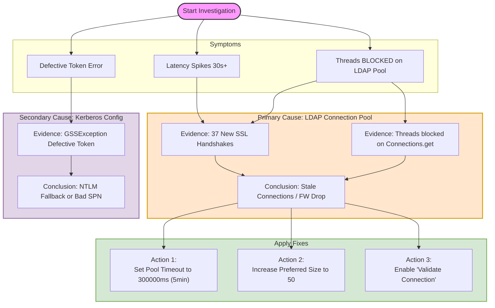

# **RH-SSO Performance & Kerberos Investigation Guide**

## **1\. Executive Summary**

**Issue:** RH-SSO is experiencing periodic latency spikes (up to 30s) on standard endpoints (e.g., .well-known/openid-configuration) and intermittent GSSException: Defective token errors.

**Impact:** Slow authentication flows and potential timeouts for applications relying on SSO.

**Root Cause:** 1\. **Primary (Latency):** Contention in the Java LDAP connection pool due to an excessively long timeout (50 minutes) causing threads to block while waiting for dead TCP connections to be detected and refreshed.

2\. **Secondary (Errors):** Potential Kerberos Keytab version mismatch or browser trust configuration issues causing NTLM fallback.

## **2\. Root Cause Analysis**

### **A. The Latency ("The 30-second Hang")**

The provided Thread Dumps are the "Smoking Gun".

* **Observation:** Threads are in BLOCKED (on object monitor) state at com.sun.jndi.ldap.pool.Connections.get.  
* **Observation:** There are frequent SSLSocketImpl.startHandshake calls, indicating the pool is churning connections rather than reusing them efficiently.  
* **Mechanism:** The current Connection Pool Timeout is set to **3,000,000ms (50 minutes)**. Most network firewalls/load balancers silently drop idle TCP connections after 5-10 minutes. When RH-SSO tries to reuse a connection that has been idle for 15 minutes, the request hangs waiting for a TCP ACK that never comes, eventually timing out (often \~30s) before forcing a new connection handshake.

### **B. The Kerberos Error ("Defective Token")**

* **Error:** SPNEGO login failed: ... GSSException: Defective token detected.  
* **Mechanism:** This specific error usually implies the token sent by the browser is not a valid Kerberos Ticket. This happens if the browser falls back to NTLM (which RH-SSO cannot decrypt as Kerberos) or if the Service Principal Name (SPN) in the Keytab does not match what the browser encrypted against.

## **3\. Remediation Plan**

To stabilize the system, we must align the application configuration with network realities.

| Setting | Current Value | Recommended Value | Reasoning |
| :---- | :---- | :---- | :---- |
| **Connection Pool Timeout** | 3000000 (50 min) | **300000 (5 min)** | Forces RH-SSO to retire connections *before* the network firewall drops them. |
| **Preferred Pool Size** | 5 | **50** | Prevents thread blocking during login bursts by keeping more warm connections ready. |
| **Validate Connection** | (Unset/False) | **true** | Ensures a connection is alive before handing it to a request thread. |

## **4\. Implementation Steps**

### **Step 1: Apply LDAP Fixes (via kcadm.sh)**

*Run this on the RH-SSO server.*

\# 1\. Log in to the Admin CLI  
cd /opt/rh/rh-sso-7/bin/  
./kcadm.sh config credentials \--server https://localhost:8443/auth \--realm master \--user admin

\# 2\. Identify your LDAP Provider ID  
\# Look for the 'id' in the output (e.g., "3892-ab12-...")  
./kcadm.sh get components \-r sso-realm \--query providerId=ldap

\# 3\. Apply the Configuration Update  
\# Replace 'YOUR\_COMPONENT\_ID' with the ID found above  
./kcadm.sh update components/YOUR\_COMPONENT\_ID \-r sso-realm \\  
\-s 'config."connectionPooling"=\["true"\]' \\  
\-s 'config."connectionPoolTimeout"=\["300000"\]' \\  
\-s 'config."connectionPoolPreferredSize"=\["50"\]' \\  
\-s 'config."connectionPoolMaxSize"=\["1000"\]'

### **Step 2: Verification Logging (via jboss-cli.sh)**

*Enable temporary debug logging to confirm pool behavior.*

\# 1\. Connect to JBoss CLI  
cd /opt/rh/rh-sso-7/bin/  
./jboss-cli.sh \--connect

\# 2\. Enable Pool Debugging  
/subsystem=logging/logger=com.sun.jndi.ldap.connect.pool:add(level=DEBUG)

\# 3\. Monitor Logs (in separate terminal)  
\# tail \-f /opt/rh/rh-sso-7/standalone/log/server.log | grep "com.sun.jndi.ldap"

\# 4\. Disable Logging (After verification)  
/subsystem=logging/logger=com.sun.jndi.ldap.connect.pool:remove

## **5\. Troubleshooting Playbook**

If the latency resolves but Defective Token errors persist, execute this workflow.

### **Phase A: Kerberos Integrity**

1. **Verify Keytab Content:**  
   klist \-k \-t /etc/krb5.keytab  
   \# Ensure exact match: HTTP/sso\_server.domain.com@REALM

2. **Test Local Authentication (Simulation):**  
   kinit \-k \-t /etc/krb5.keytab HTTP/sso\_server.domain.com@REALM  
   \# Must return exit code 0\. If "Password Incorrect", Keytab is invalid.

3. **Check KVNO Mismatch:**  
   kvno HTTP/sso\_server.domain.com@REALM  
   \# Compare output number with the version shown in 'klist \-k'

### **Phase B: Network Health**

1. **Check for "Zombie" Connections:**  
   \# Run during a slowdown  
   netstat \-anp | grep :636 | awk '{print $6}' | sort | uniq \-c  
   \# High count of SYN\_SENT or CLOSE\_WAIT indicates network/application mismatch.

## **6\. Visual Investigation Map**

